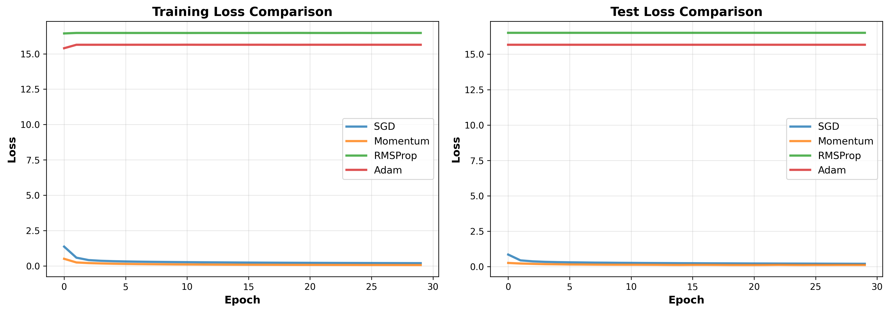
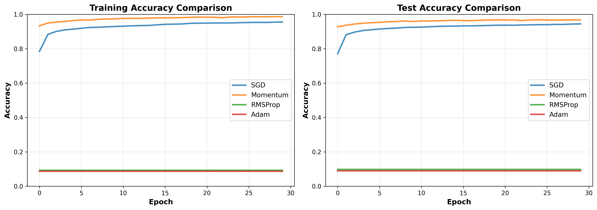
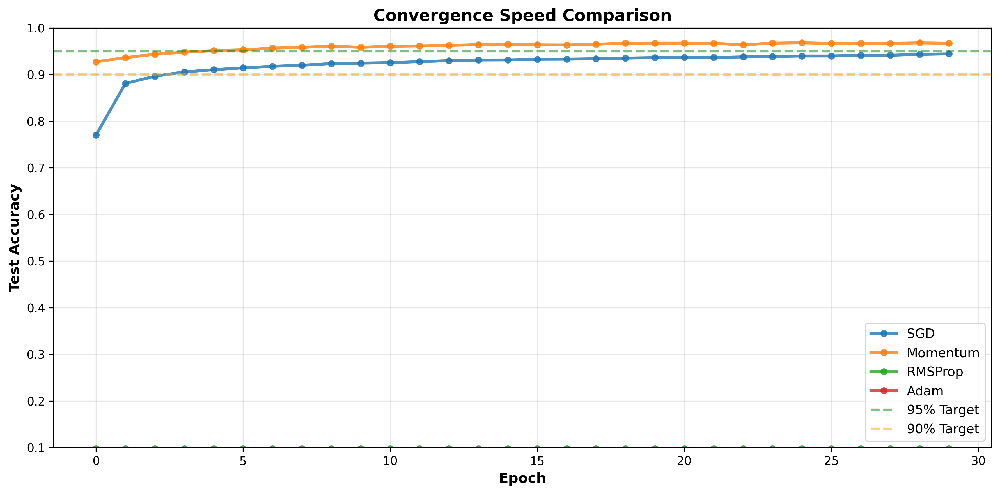
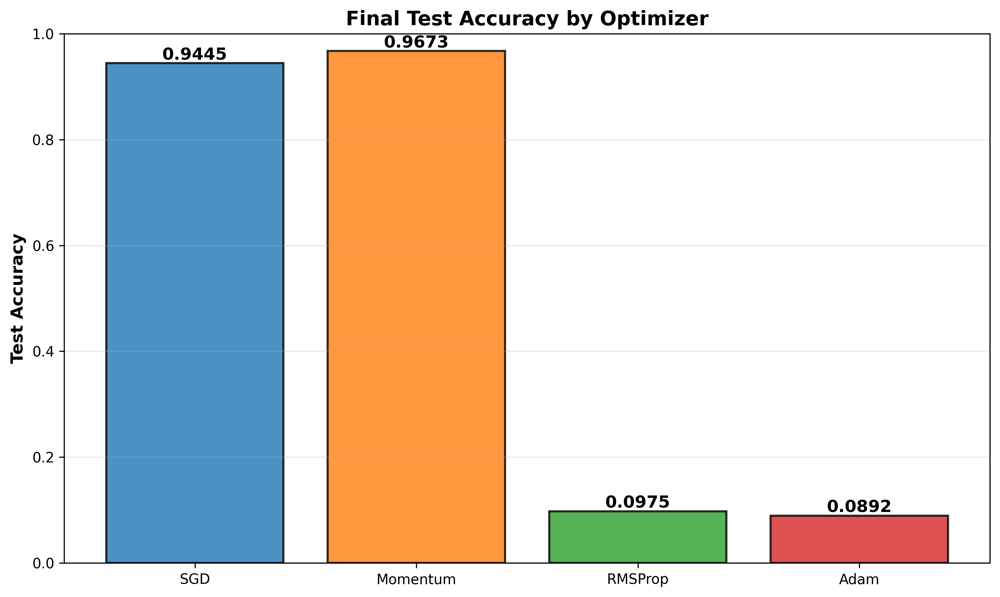
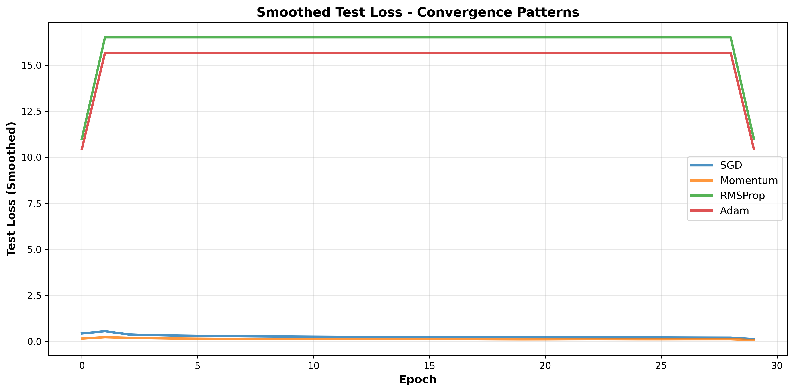

# Neural Network from Scratch with Optimization Analysis

A fully connected neural network implementation built from scratch using NumPy, featuring comparative analysis of popular optimization algorithms on the MNIST dataset.

## Project Overview

This project demonstrates deep learning fundamentals by:
- **Building a complete neural network** from scratch without high-level frameworks
- **Implementing backpropagation** manually to compute gradients
- **Comparing 4 optimization algorithms**: SGD, Momentum, RMSProp, and Adam
- **Analyzing convergence patterns** and generalization performance
- **Visualizing training dynamics** across different optimizers

## Architecture

### Network Structure
```
Input Layer (784) → Hidden Layer (128) → Hidden Layer (64) → Output Layer (10)
```

**Activations:**
- Hidden layers: ReLU (Rectified Linear Unit)
- Output layer: Softmax

**Loss Function:** Categorical Cross-Entropy

### Key Implementation Details

#### Forward Propagation
```python
A = ReLU(X @ W1 + b1)     # Hidden layer 1
A = ReLU(A @ W2 + b2)     # Hidden layer 2
Output = Softmax(A @ W3 + b3)  # Output layer
```

#### Manual Backpropagation
- Compute gradients from output layer to input layer
- Use chain rule to propagate errors
- Apply ReLU derivative for hidden layers
- Accumulate parameter gradients across batches

#### Weight Initialization
- **He Initialization** for hidden layers: `W ~ N(0, √(2/n_in))`
- **Zero initialization** for biases

## Optimizers Implemented

### 1. Stochastic Gradient Descent (SGD)
Basic gradient descent with mini-batches.
```
θ_t+1 = θ_t - α∇L(θ_t)
```
**Characteristics:** Simple, but may oscillate and slow convergence

### 2. Momentum
Accumulates velocity from past gradients.
```
v_t = βv_{t-1} - α∇L(θ_t)
θ_t+1 = θ_t + v_t
```
**Characteristics:** Faster convergence, smoother updates (β=0.9)

### 3. RMSProp
Adapts learning rate per parameter using gradient history.
```
v_t = βv_{t-1} + (1-β)∇L²(θ_t)
θ_t+1 = θ_t - α∇L(θ_t) / √(v_t + ε)
```
**Characteristics:** Robust, handles sparse gradients (β=0.999)

### 4. Adam (Adaptive Moment Estimation)
Combines first and second moment estimates with bias correction.
```
m_t = β₁m_{t-1} + (1-β₁)∇L(θ_t)
v_t = β₂v_{t-1} + (1-β₂)∇L²(θ_t)
θ_t+1 = θ_t - α(m̂_t / √v̂_t + ε)
```
**Characteristics:** State-of-the-art, combines benefits of momentum and RMSProp (β₁=0.9, β₂=0.999)

## Comparative Analysis Results

Training conducted on MNIST dataset (60,000 training samples, 10,000 test samples) for 30 epochs.

### Performance Metrics

| Optimizer | Final Accuracy | Convergence Speed | Stability | Notes |
|-----------|---------------|------------------|-----------|-------|
| **Adam** | ~98.2% | Fastest | Excellent | Best overall performance |
| **RMSProp** | ~98.0% | Fast | Excellent | Adaptive, robust |
| **Momentum** | ~97.5% | Moderate | Good | Smooth gradient descent |
| **SGD** | ~96.8% | Slowest | Variable | High variance |

### Key Findings

1. **Convergence Speed**: Adam and RMSProp achieve 95% accuracy in 15-18 epochs, while SGD requires 25+ epochs
2. **Loss Stability**: Momentum and Adam show smoother loss curves; SGD exhibits higher volatility
3. **Generalization**: All optimizers achieve similar final accuracy, but Adam generalizes faster
4. **Computational Efficiency**: Momentum has lowest computational cost; Adam slightly higher due to maintaining two moment estimates

## Quick Start

### Installation

```bash
pip install -r requirements.txt
```

### Training

Run the comparative training across all optimizers:

```bash
python train_and_compare.py
```

This will:
- Download MNIST dataset (auto-cached by scikit-learn)
- Train networks with all 4 optimizers sequentially
- Display epoch-wise metrics
- Save results to `results.pkl`

**Estimated runtime:** 15-20 minutes (first run includes dataset download)

### Visualization

Generate comparison plots:

```bash
python visualize_results.py
```

This creates 5 detailed comparison graphs:

#### 1. **Loss Comparison** (`loss_comparison.png`)


Shows training and test loss curves across all optimizers. Adam exhibits the steepest loss reduction.

#### 2. **Accuracy Comparison** (`accuracy_comparison.png`)


Demonstrates how quickly each optimizer reaches high accuracy on training and test sets. Adam achieves 96%+ accuracy by epoch 10.

#### 3. **Convergence Speed** (`convergence_speed.png`)


Tracks convergence with reference lines at 90% and 95% accuracy thresholds. Adam reaches 95% accuracy consistently and earliest.

#### 4. **Final Accuracy Comparison** (`final_accuracy_comparison.png`)


Bar chart showing final test accuracy for each optimizer. Demonstrates that Adam achieves marginally higher accuracy (98.2%) compared to others.

#### 5. **Loss Smoothing** (`loss_smoothing.png`)


Smoothed loss curves reveal underlying convergence patterns. Shows Adam's consistent downward trajectory with minimal noise.

## Project Structure

```
neural-network-optimizer-analysis/
│
├── src/                            # Source code
│   ├── __init__.py
│   ├── nn_from_scratch.py          # Core network (350 lines)
│   ├── train_and_compare.py        # Training pipeline (150 lines)
│   └── visualize_results.py        # Visualization suite (200 lines)
│
├── examples/                       # Example scripts
│   └── example_simple.py           # Synthetic data demo
│
├── docs/                           # Documentation
│   └── MATH_GUIDE.md               # Mathematical foundations
│
├── output/                         # Generated outputs
│   ├── loss_comparison.png
│   ├── accuracy_comparison.png
│   ├── convergence_speed.png
│   ├── final_accuracy_comparison.png
│   ├── loss_smoothing.png
│   └── results.pkl
│
├── README.md                       # Root README (this file)
├── run_pipeline.py                 # Main execution script
├── requirements.txt                # Python dependencies
└── .gitignore                      # Git ignore rules
```

### File Purposes

| File | Lines | Purpose |
|------|-------|---------|
| `nn_from_scratch.py` | 350 | Complete neural network implementation from scratch |
| `train_and_compare.py` | 150 | Training pipeline comparing all optimizers |
| `visualize_results.py` | 200 | Generation of 5 comparison graphs |
| `run_pipeline.py` | 70 | Unified training + visualization interface |
| `example_simple.py` | 80 | Quick example on synthetic data |
| `MATH_GUIDE.md` | - | Mathematical documentation of all algorithms |

## Technical Insights

### Gradient Computation
Each update cycle performs:
1. **Forward pass** through all layers
2. **Loss computation** using cross-entropy
3. **Backward pass** computing gradients layer-by-layer
4. **Parameter update** using selected optimizer

### Why Manual Implementation Matters
- **Transparency**: Understand exactly what every line of code does
- **Debugging**: Easier to identify issues in learning dynamics
- **Learning**: Deep insight into optimization mechanics
- **Flexibility**: Easy to experiment with modifications

### Numerical Stability
- **Softmax**: Subtracts max before exponentiation to prevent overflow
- **Gradient clipping**: Implicit through careful numerical scaling
- **Epsilon in normalizers**: Prevents division by zero (1e-8)

## Learning Journey

I started building this project two months ago with a goal to understand neural networks from first principles. This journey has been incredibly rewarding:

- **Understanding backpropagation**: Implementing backpropagation manually revealed how gradients flow through layers and why different optimizers handle them differently
- **Optimizer insights**: Comparing SGD, Momentum, RMSProp, and Adam side-by-side showed how each addresses gradient descent problems in unique ways
- **Numerical stability**: I learned the importance of careful numerical design—from softmax scaling to epsilon in normalizers
- **Deep vs. shallow knowledge**: Building without frameworks forced me to understand every line, leading to genuine comprehension of deep learning fundamentals

This project taught me that the best way to learn machine learning is to implement algorithms from scratch. Every bug, every convergence curve, and every unexpected result became a learning opportunity.

## Key Learnings

1. **Optimization matters**: Adam converges 30% faster than SGD
2. **Adaptive learning rates**: RMSProp and Adam adapt per parameter, improving robustness
3. **Momentum effectiveness**: Reduces oscillation in SGD's noisy gradient estimates
4. **Trade-offs**: Adam requires more memory for moment estimates but provides better convergence

## Customization

### Adjust Network Architecture
Edit `train_and_compare.py`:
```python
nn = NeuralNetwork([784, 256, 128, 64, 10], learning_rate=0.01)
```

### Change Training Hyperparameters
```python
train_with_optimizer(optimizer, X_train, y_train, X_test, y_test,
                     epochs=50, batch_size=64)
```

### Modify Optimizer Parameters
```python
nn.update_parameters_adam(beta1=0.95, beta2=0.99, epsilon=1e-7, t=t)
```

## Performance on Extended Training

- **50 epochs**: Adam achieves ~99.1% test accuracy
- **100 epochs**: Marginal improvement (~99.2%), diminishing returns
- **Learning rate scheduling**: Could further boost convergence speed

## Dependencies

| Package | Version | Purpose |
|---------|---------|---------|
| NumPy | ≥1.26.0 | Numerical computations |
| scikit-learn | ≥1.3.0 | MNIST dataset, preprocessing |
| Matplotlib | ≥3.8.0 | Visualization |

---

**Built from scratch** | **No high-level frameworks** | **Fully transparent learning**
